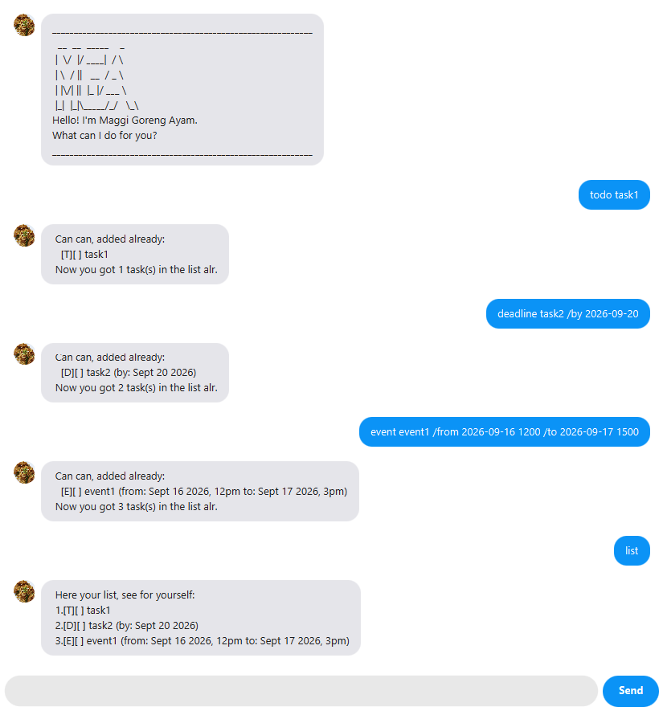

# Maggi Goreng Ayam User Guide

**Maggi Goreng Ayam** is a desktop chatbot that helps you keep track of your
tasks — todos, deadlines, and events — through simple typed commands. It's
optimized for fast typists: if you can type, it can manage your tasks
faster than any mouse-driven app.

It also has a personality: expect replies in playful Singlish ("Can can,
added already!"). Don't worry — every message is still exactly the
information you need, just with some local flavour on top.



## Table of Contents

- [Quick start](#quick-start)
- [Features](#features)
  - [Adding a to-do: `todo`](#adding-a-to-do-todo)
  - [Adding a deadline: `deadline`](#adding-a-deadline-deadline)
  - [Adding an event: `event`](#adding-an-event-event)
  - [Listing all tasks: `list`](#listing-all-tasks-list)
  - [Marking a task as done: `mark`](#marking-a-task-as-done-mark)
  - [Unmarking a task: `unmark`](#unmarking-a-task-unmark)
  - [Deleting a task: `delete`](#deleting-a-task-delete)
  - [Finding tasks: `find`](#finding-tasks-find)
  - [Viewing tasks on a date: `on`](#viewing-tasks-on-a-date-on)
  - [Finding free time: `freetime`](#finding-free-time-freetime)
  - [Viewing help: `help`](#viewing-help-help)
  - [Exiting the app: `bye`](#exiting-the-app-bye)
- [Saving your data](#saving-your-data)
- [Command summary](#command-summary)

## Quick start

1. Ensure you have **Java 25** or above installed.
2. Clone or download this repository.
3. Open a terminal in the project folder and build the jar:
   ```
   ./gradlew shadowJar
   ```
   This produces `build/libs/MaggiGorengAyam.jar`.
4. Run it:
   ```
   java -jar build/libs/MaggiGorengAyam.jar
   ```
   A chat window should appear in a few seconds, with a welcome message.
5. Type a command into the text box at the bottom and press Enter (or
   click **Send**) to run it. Try `help` first to see everything it can
   do, or refer to the [Features](#features) below.

## Features

**A note on the command format:**
- Words in `UPPER_CASE` are parameters you supply, e.g. in
  `todo DESCRIPTION`, `DESCRIPTION` could be `todo buy milk`.
- Dates are typed as `yyyy-MM-dd` (e.g. `2019-12-02`); a non-existent date
  like `2019-02-30` is rejected, not silently corrected.
- Times, where accepted, are optional and typed as a 24-hour `HHmm` right
  after the date, separated by a space (e.g. `2019-12-02 1800` for 6pm).
- A task description can't contain `|` or a line break — those characters
  are reserved for how tasks are saved to disk.
- Adding a task that's an exact duplicate (same type, description, and
  date/time) of one already in your list is rejected, so your list never
  ends up with silent double entries.

### Adding a to-do: `todo`

Adds a task with just a description, no date attached.

Format: `todo DESCRIPTION`

Example: `todo buy milk`
```
Can can, added already:
   [T][ ] buy milk
Now you got 1 task(s) in the list alr.
```

### Adding a deadline: `deadline`

Adds a task that needs to be done by a specific date (and optionally
time).

Format: `deadline DESCRIPTION /by DATE[ TIME]`

Example: `deadline return book /by 2019-12-02 1800`
```
Can can, added already:
   [D][ ] return book (by: Dec 2 2019, 6pm)
Now you got 1 task(s) in the list alr.
```

### Adding an event: `event`

Adds a task spanning a start and end date/time.

Format: `event DESCRIPTION /from DATE[ TIME] /to DATE[ TIME]`

The end must be strictly after the start. If you leave out the time on
both sides and use the same date for `/from` and `/to`, that's treated as
a valid all-day event.

Example: `event project meeting /from 2019-12-02 1400 /to 2019-12-02 1600`
```
Can can, added already:
   [E][ ] project meeting (from: Dec 2 2019, 2pm to: Dec 2 2019, 4pm)
Now you got 1 task(s) in the list alr.
```

### Listing all tasks: `list`

Shows every task currently in your list, numbered from 1, in the order
you added them.

Format: `list`

### Marking a task as done: `mark`

Marks the given task (by its number in `list`) as done.

Format: `mark INDEX`

Example: `mark 1` (marking the `buy milk` to-do from the example above, if
it's task 1 in your list)
```
Wah steady! Marked done already:
   [T][X] buy milk
```

### Unmarking a task: `unmark`

Marks the given task as not done.

Format: `unmark INDEX`

Example: `unmark 2`

### Deleting a task: `delete`

Removes the given task from the list. Every task after it shifts down by
one number.

Format: `delete INDEX`

Example: `delete 2`

### Finding tasks: `find`

Shows every task whose description contains the given keyword
(case-insensitive). Doesn't change your list.

Format: `find KEYWORD`

Example: `find book`

### Viewing tasks on a date: `on`

Shows every deadline due on the given date, and every event that spans
it (from its start date to its end date, inclusive).

Format: `on DATE`

Example: `on 2019-12-02`

### Finding free time: `freetime`

Finds the nearest day (starting today, up to 30 days ahead) with a free
slot of at least the given length, inside a daily time window you choose.
Only events count as "busy" time - todos and deadlines don't block a
slot.

Format: `freetime HOURS WINDOW_START WINDOW_END`

- `HOURS` may be decimal, e.g. `2.5` for two and a half hours.
- `WINDOW_START`/`WINDOW_END` are 24-hour `HHmm` times, e.g. `0900` and
  `1800` for a 9am-6pm working day. `WINDOW_END` must be later than
  `WINDOW_START`.

Example: `freetime 4 0900 1800`
```
Here, you free on Dec 3 2019, from 9am to 1pm.
```

### Viewing help: `help`

Shows the full list of commands and their format, right inside the app -
handy if you forget the syntax for something.

Format: `help`

### Exiting the app: `bye`

Closes the app.

Format: `bye`

## Saving your data

Your tasks are saved automatically to `data/maggigorengayam.txt` (next to
where you run the app) after every command that changes the list - no
need to save manually. The same file is shared if you also run the app's
command-line version, so either one sees the other's changes. The data
loads back in automatically the next time you open the app.

## Command summary

| Action | Format | Example |
|---|---|---|
| Add a to-do | `todo DESCRIPTION` | `todo buy milk` |
| Add a deadline | `deadline DESCRIPTION /by DATE[ TIME]` | `deadline return book /by 2019-12-02 1800` |
| Add an event | `event DESCRIPTION /from DATE[ TIME] /to DATE[ TIME]` | `event meeting /from 2019-12-02 1400 /to 2019-12-02 1600` |
| List all tasks | `list` | `list` |
| Mark as done | `mark INDEX` | `mark 2` |
| Unmark | `unmark INDEX` | `unmark 2` |
| Delete | `delete INDEX` | `delete 2` |
| Find | `find KEYWORD` | `find book` |
| View tasks on a date | `on DATE` | `on 2019-12-02` |
| Find free time | `freetime HOURS WINDOW_START WINDOW_END` | `freetime 4 0900 1800` |
| Help | `help` | `help` |
| Exit | `bye` | `bye` |
